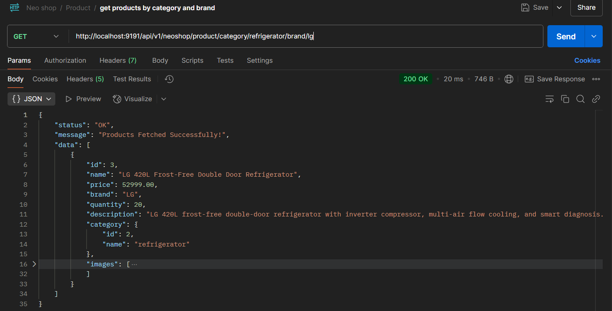
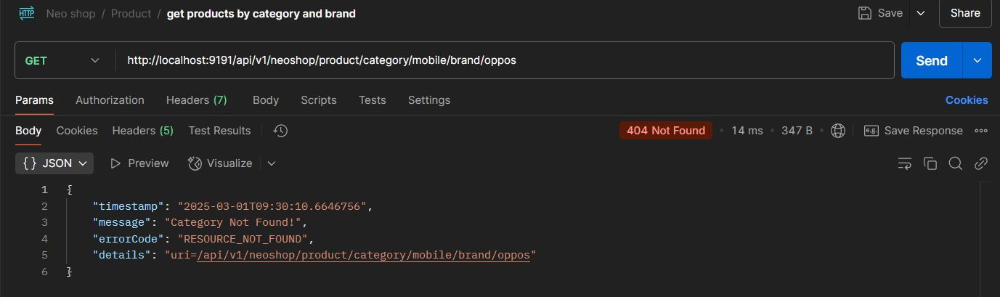
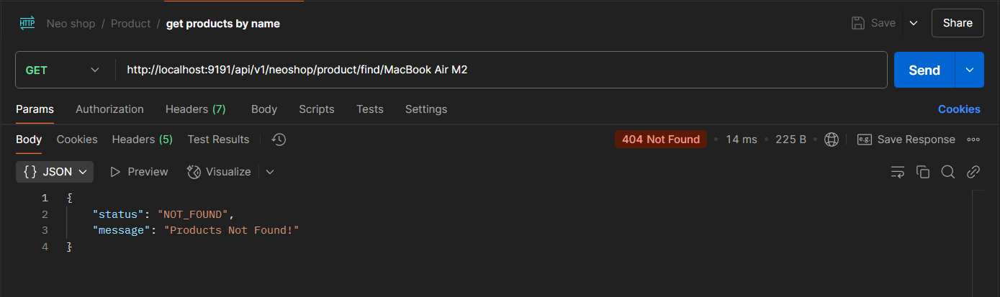

# Neo Shop - Spring Boot E-Commerce Application

Welcome to **Neo Shop**, a Spring Boot-powered eCommerce application. This project serves as a backend solution for an
online shopping platform, featuring product management, user authentication, and order processing.

## 📌 Table of Contents

- [Features](#features)
- [Technologies Used](#technologies-used)
- [Installation](#installation)
- [Database Schema](#database-schema)
- [API Endpoints](#api-endpoints)
- [Project Structure](#project-structure)

---

# Features

- User authentication (JWT-based login & registration)
- Product management (CRUD operations)
- Shopping cart and order management
- Role-based access control (Admin & User)
- Secure payment gateway integration (Placeholder)
- REST-ful API endpoints
- H2 database for development, MySQL for production

---

# Technologies Used

- **Backend**: Spring Boot, Spring Security, Spring Data JPA
- **Database**: MySQL
- **Authentication**: JWT (JSON Web Tokens)
- **Build Tool**: Maven
- **Testing Tool**: Postman

---

# Installation

1. **Clone the repository**
   <details>
     <summary><b>github</b></summary>

      ```sh
      git clone https://github.com/suraj-khot-19/NeoShop.git
      ```
   </details>

2. **Configure Database**
   Update application.properties for MySQL.
   <details>
     <summary><b>application.properties</b></summary>

    ```properties
    #server
    server.port=${SPRING_NEO_SHOP_SERVER_PORT}
    
    #mysql
    spring.datasource.url=${SPRING_NEO_SHOP_MYSQL_URL}
    spring.datasource.username=${SPRING_NEO_SHOP_MYSQL_USER}
    spring.datasource.password=${SPRING_NEO_SHOP_MYSQL_PASS}
    
    #hibernate
    spring.jpa.show-sql=true
    spring.jpa.properties.hibernate.format_sql=true
    spring.jpa.hibernate.ddl-auto=update
    
    #image size
    spring.servlet.multipart.max-file-size=5MB
    spring.servlet.multipart.max-request-size=5MB
    ```
   </details>

3. **.env config**
   <details>
     <summary><b>.env</b></summary>

      ```properties
       SPRING_NEO_SHOP_MYSQL_PASS=PASSWORD
   SPRING_NEO_SHOP_MYSQL_URL=jdbc:mysql://localhost:3306/DB_NAME
   SPRING_NEO_SHOP_MYSQL_USER=USERNAME
   SPRING_NEO_SHOP_SERVER_PORT=SERVER_PORT
      ```

   </details>

4. **Build & Run the Application**

---

# Database Schema

## mysql schema


<br>

<details>
  <summary><b>Product</b></summary>

| Field       | Type          | Null | Key | Default | Extra          |
  |-------------|---------------|------|-----|---------|----------------|
| id          | bigint        | NO   | PRI | NULL    | auto_increment |
| brand       | varchar(255)  | YES  |     | NULL    |                |
| description | varchar(255)  | YES  |     | NULL    |                |
| name        | varchar(255)  | YES  |     | NULL    |                |
| price       | decimal(38,2) | YES  |     | NULL    |                |
| quantity    | int           | NO   |     | NULL    |                |
| category_id | bigint        | YES  | MUL | NULL    |                |

</details>
<details>
  <summary><b>Category</b></summary>

| Field | Type         | Null | Key | Default | Extra          |
|-------|--------------|------|-----|---------|----------------|
| id    | bigint       | NO   | PRI | NULL    | auto_increment |
| name  | varchar(255) | YES  |     | NULL    |                |

</details>

<details>
  <summary><b>Image</b></summary>

| Field      | Type         | Null | Key | Default | Extra          |
|------------|--------------|------|-----|---------|----------------|
| id         | bigint       | NO   | PRI | NULL    | auto_increment |
| file_name  | varchar(255) | YES  |     | NULL    |                |
| file_type  | varchar(255) | YES  |     | NULL    |                |
| image      | longblob     | YES  |     | NULL    |                |
| url        | varchar(255) | YES  |     | NULL    |                |
| product_id | bigint       | YES  | MUL | NULL    |                |

</details>


---

# API Endpoints

<details>
  <summary><b>Product</b></summary>

- **`GET /api/v1/neoshop/product/all`** → Retrieves all products
    1. get all products
       

    2. error if empty list
       

- **`GET /api/v1/neoshop/product/{id}`** → Retrieves a specific product by ID
    1. product by id
       
    2. error if not found
       

- **`POST /api/v1/neoshop/product/new`** → Creates a new product (Admin only)
    1. Json in body
       ```json
       {
       "name": "LG 420L Frost-Free Double Door Refrigerator",
       "price": 52999,
       "brand": "LG",
       "quantity": 20,
       "description": "LG 420L frost-free double-door refrigerator with inverter compressor, multi-air flow cooling, and smart diagnosis.",
       "category": "refrigerator"
       }
       ```
    2. successfully create a product
       

- **`PUT /api/v1/neoshop/product/update/{id}}`** → Updates an existing product (Admin only)
    1. update an product
       

    2. If no category found it creates new
       

    3. Error if no product found
       

- **`DELETE /api/v1/neoshop/product/{id}`** → Deletes a product (Admin only)
    1. delete a product
       

    2. Error if no product found
       

- **`GET /api/v1/neoshop/product/category/{name}`** → get product by category
    1. get a product
       

    2. Error if no product found
       
    3. if no category found
       

- **`GET /api/v1/neoshop/product/brand/{name}`** → get product by brand
    1. get a product
       

    2. Error if no product found
       

- **`GET api/v1/neoshop/product/category/{category}/brand/{brand}`** → get product by category and brand
    1. get a product
       

    2. if category not exists
       

    3. Error if no product found
       

- **`GET /api/v1/neoshop/product/find/{name}`** → get product by name
    1. get a product
       

    2. if product not exists
       

- **`GET /api/v1/neoshop/product/find/{name}/brand/{brand}`** → get product by name and brand
    1. get a product
       

    2. if product not exists
       

- **`POST /api/v1/neoshop/image/upload/{id}}`** → upload image for product
    1. upload image for product
       

    2. download image or show
       
  </details>

[//]: # (<details>)

[//]: # (  <summary><b>Image</b></summary>)

[//]: # ()

[//]: # (- **`POST /api/images/upload`** → Uploads an image  )

[//]: # (  ![Upload Image]&#40;assets/images/upload-image.png&#41;)

[//]: # ()

[//]: # (- **`GET /api/images/{id}`** → Retrieves an image by ID  )

[//]: # (  ![Get Image]&#40;assets/images/get-image.png&#41;)

[//]: # ()

[//]: # (- **`DELETE /api/images/{id}`** → Deletes an image  )

[//]: # (  ![Delete Image]&#40;assets/images/delete-image.png&#41;)

[//]: # ()

[//]: # (</details>)

[//]: # ()

<details>

  <summary><b>Category</b></summary>

- **`GET api/v1/neoshop/category/all`** → Retrieves all categories
    1. get all category
       

- **`GET /api/v1/neoshop/category/{id}`** → Retrieves a category by ID
    1. get category by id
       
    2. get category error
       

- **`POST api/v1/neoshop/category/new`** → Creates a new category (Admin only)
    1. body json
        ```json
         {
         "name":"Shoes"
         } 
       ```
    2. create category
       
    3. create category error
       

- **`PUT /api/v1/neoshop/category/{id}}`** → Updates an existing category (Admin only)
    1. update category
       
    2. update category error if category not found
       
    3. update category error if exists
       

- **`DELETE api/v1/neoshop/category/{id}`** → Deletes a category (Admin only)
    1. delete category
       
    2. delete category error if not found
       
  
- **`GET /api/v1/neoshop/category/find/{name}`** → get category by name
    1. get by name category
       
    2. category error if not found
       

</details>


---

# Project Structure

```bash
NeoShop/
│── src/main/java/com/suraj/NeoShop/
│   ├── controller/     # Handles API requests
│   ├── dto/            # Data Transfer Objects
│   ├── exception/      # Custom exception handling
│   ├── mapper/         # Mapping DTOs to entities and vice versa
│   ├── model/          # Entity classes
│   ├── repository/     # Data access layer (Spring Data JPA repositories)
│   ├── request/        # Request payload models
│   ├── response/       # Response payload models
│   ├── service/        # Service interfaces
│   ├── serviceImpl/    # Service implementation classes
│── NeoShopApplication  # Main Spring Boot application entry point
```

---
